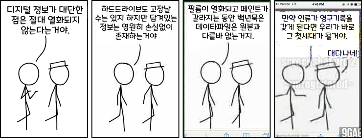

# Fiche Pédagogique

## Informations Étudiant

- **Nom : SHIN**

- **Prénom : Lita**

## Profil et Connaissances

### Présentation Personnelle

Je suis une étudiante passionnée par le design interactif et le développement web. À court terme, je souhaite améliorer mes compétences en programmation et en design d'interface. À long terme, j'aimerais travailler en tant que designer UX/UI dans une entreprise innovante. En parallèle, je suis également passionnée par l'art numérique, utilisant des codes créatifs et mêlant de nouvelles techniques telles que les NFT, l'IA, etc.

### Compétences Actuelles

### Compétences :

- **CODING** : 14/20 - Je maîtrise les bases de JavaScript et j'ai des connaissances en HTML et CSS. Je travaille régulièrement sur des projets indépendants et je suis toujours prêt à apprendre de nouvelles choses sur le codage. J'adore coder !
- **GIT ET VERSIONNING** : 13/20 - J'ai utilisé Git pour la gestion de versions de mes projets, mais je ne me sens pas encore totalement à l'aise.
- **INTERACTIVITÉ ET RENDU TEMPS RÉEL** : 11/20 - Je commence à expérimenter avec des frameworks comme p5.js., Node.js, REACT, etc.
- **DESIGN GRAPHIQUE ET MÉDIAS INTERACTIFS** : 18/20 - Je maîtrise bien les outils courants tels que Photoshop, Figma, Illustrator, InDesign, Premiere Pro et After Effects, ainsi que des logiciels comme Clip Studio, Blender et TV Paint. En tant qu'ancien étudiant en animation, je peux affirmer avec certitude que mes compétences en dessin sont les meilleures de l'école. De plus, j'ai une connaissance approfondie et un grand intérêt pour l'animation, le cinéma, les médias vidéo et le design, ce qui, à mon avis, constitue un atout majeur en tant que designer.
- **INSTALLATION ET MISE EN ESPACE** : 14/20 - J'ai travaillé sur quelques projets d'installation artistique il y a 3-4 ans. Même si je n'ai pas travaillé récemment dans ce domaine, j'y porte toujours un grand intérêt et une grande affection. Vous pouvez consulter mon portfolio de cette période ici.
- **PRÉSENTATION ET ARGUMENTATION** : 13/20 - Je suis capable de présenter mes idées de manière claire, mais je souhaite m'améliorer dans l'art de convaincre. Mon principal obstacle est que je ne maîtrise pas encore parfaitement le français, et j'en suis conscient. Cependant, je suis clair sur ce que je veux exprimer dans mon travail et dans mes recherches, donc je ne pense pas qu'il y aura de problèmes tant que j'améliore ma capacité à le transmettre. Par ailleurs, je parle également quatre langues : anglais, français, coréen et japonais.

## Projet et Thématique de Recherche

# Projet 1

### Sujet de Projet

- **Titre du projet** : (Titre provisoire) _Lita de Thésée_
- **Description du projet (environ 150 mots) :** Les gens vont et viennent à mes côtés. On fait connaissance lorsqu'on fréquente la même école ou qu'on participe à un échange, puis chacun suit son propre chemin ou retourne dans son pays d'origine. Toutes ces rencontres laissent de petites traces sur moi : les conversations que j'ai eues, les connaissances que j'ai acquises, leur musique ou leur nourriture préférée, ainsi que nos divergences d'opinions... Avec toutes ces nouveautés, je suis un peu différente du passé. Je suis la même personne qu'il y a 10 ans, mais j'ai beaucoup changé, et je serai encore la même dans 10 ans. Je change avec le temps. Mais cela a toujours été moi, et cela le sera toujours, même lorsque vous êtes à mes côtés ou lorsque vous ne l'êtes pas. Mon but est de faire de ces cours un art interactif et visuel.

### Thématiques de Recherche

- **Thématiques que vous souhaitez explorer :** **_Les mythes, lores et Religions_**
- **Pourquoi cette thématique vous intéresse-t-elle ? (environ 100 mots) :** Les mythes reflètent les angoisses, les préoccupations et les souffrances de l'humanité. Ils illustrent les luttes et les dilemmes qui jalonnent notre existence. Ils accompagnent l'humanité depuis ses débuts. La foi, la religion et l'espoir, tels qu'ils se manifestent dans la mythologie, constituent également des aspects indissociables de l'être humain. Ce qui est surprenant, c'est que l'angoisse qu'ils véhiculent, présente depuis des milliers d'années, persiste encore aujourd'hui, même pour moi, née en 2001, au début du 21e siècle. En tant que membre de la génération Z, j'éprouve des difficultés à reconstruire ces récits communs et bien connus à l'aide des nouvelles technologies.

## Outils et Techniques

- **Outils que vous comptez utiliser (logiciels, langages de programmation, etc.) :** HTML, CSS, JavaScript, p5.js, Figma, Photoshop, Premier Pro, Blender
- **Techniques spécifiques que vous souhaitez maîtriser ou expérimenter :** Unity, Vue.js autres langages de codage utilisés dans le codage créatif.

## Références Artistiques

- **Argumentaire expliquant la pertinence de votre projet (environ 150 mots) :**
- **Références artistiques qui inspirent votre travail (livres, artistes, œuvres, etc.) :**

## Actions

### Contribution à un Projet d'Autre Étudiant

// Décrivez comment vous comptez contribuer au projet d'un autre étudiant (proposition d'idées, aide technique, etc.) :

### **CRÉATION D'UN SUJET DE RECHERCHE**

// Vous devrez tous écrire un sujet de recherche, une thématique ou un propos de création lié à l'un de vos projets. Par exemple, si vous avez un projet de création d'un outil de capture d'image basé sur des algorithmes, vous devrez formuler un intitulé pour cette pratique : « Création de capture d'image algorithmique sur mobile ».

### Participation à un Sujet de Recherche

// Quel sujet de recherche proposé par un étudiant vous intéresse et pourquoi ? :

### Contributions aux ressources

Des ressources communes seront alimentées par tous. Chaque étudiant devra contribuer et enrichir cet ensemble de ressources.

### **PRÉSENTATION DE 20 MINUTES SUR UN SUJET ARTISTIQUE/DESIGN (RECHERCHE THÉORIQUE)**

## Planification

### Planning de Travail

- Établissez un planning des étapes clés pour votre projet :
  - **Étape 1 :** Date et description
  - **Étape 2 :** Date et description
  - **Étape 3 :** Date et description

## Commentaires et Questions

//Avez-vous des questions ou des préoccupations à propos du cours ou de vos projets ? :

---

# Journal de Bord

==

##### 테세우스의 리타

###### 너희들이 떠나간 뒤의 나도 나고, 너희와 함께하던 때에도 나였다. 나는 과거로부터 늘 나였고 미래에도 나일 것이다. 하지만 너희가 지나간 뒤의 나는 바뀌었어.

people comes and goes
그리고 파편화된 나, 왜냐하면 ‘나’의 존재란 타인의 관측에 의해서만 확정되기 때문이다. 내가 홀로 이 우주에 스스로 존재할 수는 없어, 너희들이 있어야만 나는 ‘내’가 돼.

그리고 그들은 자꾸만 흔적만 남기고 나를 떠나고는 한다.
아마 내 옆에 앉은 이 친구들도 나를 떠날 것이다. 우리는 잠깐 같은 길을 걸어간 뒤에 곧 헤어진다.

##### 그러면 그 comes and goes 를 nft와 웹 서버를 사용해서 시각화시켜보고 싶다.

사주팔자에 대한 아이디어 역시 사용해보고 싶어. 흥미본위이지만 무척 재밌는 내용이라.

너희가 지나간 뒤의 나는 달라졌는데 여전히 나이고, 너희는 너희이고… 나는 얼마만큼이나 너희들에게 영향을 끼치고 있을까?

또한 : 오래된 신화의 재해석. 21세기식, 최신 기술을 사용한 21세기 소녀ㅋㅋ의 point de vue

---

## 051124

내 안에서 타인의 존재는 절대적이다. 독립적이고 유일하게 우뚝 서 있다. 우리가 만났던 사실은 transaction 기록으로서 지워지지 않는다.

과정

개인에 따른 nft 생성(미리 해야함) -> 지갑은 두 개가 필요. 둘 다 내 소유. 수많은 nft들이 등록된 지갑 하나와 nft들을 받을 지갑 하나.

html 페이지에다 어떤 사용자가 정보를 입력하면 그 정보를 서버로 보냄, 그 정보는 변환되어 nft중 해당하는 것 하나를 등록지갑에서 받는지갑으로 보냄. 그러면 그 정보를 받아와서 html 페이지에 표시한다.

- Ref

  - à Émilie: creative coding de [takawo](https://openprocessing.org/user/6533?view=sketches&o=48)
  - data visualisation qui utilise nft comme un media, des medium
    
    너무 아름답지않냐..

    [Charles Joseph Minard — Wikipédia](https://fr.wikipedia.org/wiki/Charles_Joseph_Minard)

---

## 121124

Le mythe se réinvente à chaque époque. Il reflète les angoisses, les préoccupations et les souffrances de l'humanité. Ils illustrent les luttes et les dilemmes qui jalonnent notre existence. Ils accompagnent l'humanité depuis ses débuts. La foi, la religion et l'espoir, tels qu'ils se manifestent dans la mythologie, constituent également des aspects indissociables de l'être humain. Ce qui est surprenant, c'est que l'angoisse qu'ils véhiculent, présente depuis des milliers d'années, persiste encore aujourd'hui, même pour moi, née en 2001, au débuts du 21e siècle. En tant que membre de la génération Z, j'éprouve des difficultés à reconstruire ces récits communs et bien connus à l'aide des nouvelles technologies.

Les gens vont et viennent à mes côtés. On fait connaissance lorsqu'on fréquente la même école ou qu'on participe à un échange, puis chacun suit son propre chemin ou retourne dans son pays d'origine.

Toutes ces rencontres laissent de petites traces sur moi : les conversations que j'ai eues, les connaissances que j'ai acquises, leur musique ou leur nourriture préférée, ainsi que nos divergences d'opinions... Avec toutes ces nouveautés, je suis un peu différente du passé. Je suis la même personne qu'il y a 10 ans, mais j'ai beaucoup changé, et je serai encore la même dans 10 ans. Je change avec le temps. Mais cela a toujours été moi, et cela le sera toujours, même lorsque vous êtes à mes côtés ou lorsque vous ne l'êtes pas. Mon but est de faire de ces cours un art interactif et visuel.
신화는 각 시대마다 재창조됩니다. 이는 인류의 불안, 우려, 고통을 반영합니다. 그들은 우리의 존재를 나타내는 투쟁과 딜레마를 보여줍니다. 그들은 인류가 시작된 이래로 인류와 동행해 왔습니다. 신화에 나타난 믿음, 종교, 희망 역시 인간 존재의 불가분의 측면입니다. 놀라운 것은 그들이 전달하는 불안이 수천 년 동안 지속되어 왔으며, 심지어 21세기 초인 2001년에 태어난 나에게도 여전히 지속된다는 것이다. Z세대의 일원으로서 나는 이러한 일반적이고 잘 알려진 이야기를 새로운 기술을 사용하여 재구성하는 것이 어렵다는 것을 알고 있습니다.

사람들이 내 옆으로 오고 갑니다. 같은 학교를 다니거나 교류를 하면서 서로 알아가고, 각자의 길을 따르거나 모국으로 돌아가는 경우가 많습니다.
이 모든 만남은 나에게 작은 흔적을 남긴다. 내가 나눈 대화, 내가 얻은 지식, 그들이 좋아하는 음악이나 음식, 그리고 우리의 의견 차이... 이 모든 새로운 것들로 인해 나는 과거와 조금 다르다. 나는 10년 전과 같은 사람이지만 많이 변했고, 10년 후에도 여전히 같은 사람일 것이다. 나는 시간이 지남에 따라 변합니다. 하지만 그것은 언제나 나였고, 당신이 내 옆에 있을 때에도, 당신이 없을 때에도 언제나 그럴 것입니다. 나의 목표는 이러한 수업을 상호작용적이고 시각적인 예술로 만드는 것입니다.

---

## 141124

Je suis une personne très superstitieuse, tout comme beaucoup de personnes en Corée. Cela peut paraître étrange aux Français, mais faire des choix en fonction de ces croyances est si naturel que personne n’y trouve rien d’anormal. Lorsque je traverse une période difficile, ma mère consulte les caractères chinois de l'année et du mois en cours. Elle dit que s'il y a trop d'énergie de l'eau, cela me rend déprimée et rêveuse. Depuis le collège, elle m’a toujours dit de ne jamais me marier trop tôt, car je finirais certainement par divorcer. Et si je me fais une nouvelle amie, elle me conseille de connaître sa date de naissance pour comprendre quel type de personne il ou elle est. Cela peut sembler rigolo et sans aucun sens, mais c'est l'environnement dans lequel j'ai grandi.

Il est peut-être naturel que cet environnement ait fait de moi un fataliste. Tout arrive pour une raison, et les bonnes comme les mauvaises choses se répètent naturellement. Les allées et venues des gens sont également naturelles, en fonction du flux de chance de chacun.

나는 한국의 많은 사람들처럼 매우 미신을 믿는 사람입니다. 프랑스인들에게는 이것이 이상하게 보일 수도 있지만, 이러한 믿음에 기초하여 선택을 하는 것은 너무나 자연스러워서 누구도 거기에서 이상한 점을 발견하지 못합니다. 내가 힘들 때 어머니는 올해와 그 달의 한자를 찾아보곤 하신다. 물 에너지가 너무 많으면 우울하고 몽환적이라고 하더군요. 중학교 때부터 엄마는 나에게 너무 일찍 결혼하지 말라고 늘 말씀하셨다. 나는 분명히 이혼할 것이기 때문이다. 그리고 새로운 친구가 생기면 그 사람이 어떤 사람인지 알기 위해 그 사람의 생년월일을 알라고 조언한다. 우스꽝스럽고 말도 안 되는 소리로 들릴 수도 있지만 그것이 제가 자란 환경이었습니다.

어쩌면 이런 환경이 나를 운명론자로 만든 것은 당연할지도 모른다. 모든 일에는 이유가 있어서 좋은 일과 나쁜 일이 자연스럽게 반복됩니다. 사람들의 오고 가는 것 또한 모두의 행운의 흐름에 따라 자연스러운 일이다.

#### “Materialisation”

- Ref

  - [robbie barrat nft](https://www.google.com/search?sca_esv=fdc9a68c17428299&sxsrf=ADLYWIIuYkSO1ykAWQPxmXp4f3OEY5i18g:1731583763200&q=robbie+barrat+nft&udm=2&fbs=AEQNm0CbCVgAZ5mWEJDg6aoPVcBgTlosgQSuzBMlnAdio07UCFdb4kkCZQx4-ERIk5vUh0hWbBcn17qhcg4G1UyOj4Bl9j_97HfXX8OTbusU58gqfpTTpUF3jMnovRBnsQD-1SxLNszdOpGmKaKF6_vTOfYG1TtSSSrTUb5uynBwgdVG3mUF8St8xuOyCus8cfir1FAn0Ja5&sa=X&ved=2ahUKEwipv-qY3NuJAxVHcKQEHSEgF74QtKgLegQIFBAB&biw=1888&bih=927&dpr=1.35#vhid=t96-uRlK-uzrwM&vssid=mosaic)
  - [caroline delieutraz ascii](https://www.google.com/search?sca_esv=fdc9a68c17428299&sxsrf=ADLYWIJH0H-CvwzJ2GGPCic_GwiZwzaTcQ:1731583448451&q=caroline+delieutraz+ascii&udm=2&fbs=AEQNm0CbCVgAZ5mWEJDg6aoPVcBgTlosgQSuzBMlnAdio07UCId2t1azIRgowYJD0nDbqEIN7XYIyS3uBYzHmWPp2pnW7G_IJrZtNDMziXf_SeaMZv5mQEpVVAa0sN9KIj0kgaUhXfFR1pvCaBMjGis3J2-YASoH3vq235tGT22LuP522AlHeE4&sa=X&ved=2ahUKEwjl0N-C29uJAxWUcKQEHfyWJ2AQtKgLegQIExAB&biw=1888&bih=927&dpr=1.35#vhid=1CpCCnZkMQfQQM&vssid=mosaic)
  - [samuel bianchini ascii](https://www.google.com/search?q=samuel+bianchini+ascii&sca_esv=fdc9a68c17428299&udm=2&biw=1888&bih=927&sxsrf=ADLYWIJpv5iEGok0IndFGHOP_3tjONhY7Q%3A1731583477452&ei=9d01Z6umG7abkdUPgM_14Qw&ved=0ahUKEwjr9MmQ29uJAxW2TaQEHYBnPcwQ4dUDCBA&uact=5&oq=samuel+bianchini+ascii&gs_lp=EgNpbWciFnNhbXVlbCBiaWFuY2hpbmkgYXNjaWlInA5QAFirDHABeACQAQCYAVigAcwCqgEBNrgBA8gBAPgBAZgCA6ACkgHCAgcQABiABBgTwgIGEAAYExgewgIIEAAYExgIGB7CAgQQABgemAMAkgcBM6AH_AQ&sclient=img#vhid=Oc3HwIQrc1YIcM&vssid=mosaic)
  - [SAMUEL BIANCHINI - ARTJAWS.COM](https://www.artjaws.com/en/portfolio/samuel-bianchini/)
  - [aram bartholl](https://www.google.com/search?sca_esv=f66f7fdd57388f5a&sxsrf=ADLYWIIqbGhmMYSDaO4gtFOVPpr-sYwHGQ:1731584690541&q=aram+bartholl&udm=2&fbs=AEQNm0CbCVgAZ5mWEJDg6aoPVcBgTlosgQSuzBMlnAdio07UCId2t1azIRgowYJD0nDbqEIN7XYIyS3uBYzHmWPp2pnW7G_IJrZtNDMziXf_SeaMZv5mQEpVVAa0sN9KIj0kgaUhXfFR1pvCaBMjGis3J2-YASoH3vq235tGT22LuP522AlHeE4&sa=X&ved=2ahUKEwjt9ILT39uJAxXCTKQEHd4xElwQtKgLegQIExAB&biw=1888&bih=927&dpr=1.35#vhid=E5A7fdWQGcvltM&vssid=mosaic)
  - [AI Generated Nude Portrait #7 Frame #64 | The Now Evening Auction | 2022 | Sotheby's](https://www.sothebys.com/en/buy/auction/2022/the-now-evening-auction/ai-generated-nude-portrait-7-frame-64)
  - [컨셉츄얼 아트 ( Conceptual art ) : 네이버 블로그](https://blog.naver.com/stoppoint/222621362125)
  - [Mark Lombardi](https://www.google.com/search?sca_esv=4739c83ae12d61ba&sxsrf=ADLYWIIsk_uulOEQPf7BU3-cHHrQZolcfw:1730818710441&q=mark+lombardi&udm=2&fbs=AEQNm0CbCVgAZ5mWEJDg6aoPVcBgTlosgQSuzBMlnAdio07UCId2t1azIRgowYJD0nDbqEIN7XYIyS3uBYzHmWPp2pnW9Bf-eKLmWBCRbGVKatyojKtYgZDdat5BVe4bfN4h9Vq3kDh6CPN4CzfUUJz5WEWwfL1jdbNyTPwalkhQzFotKX3TwUY35qtfYYbz34HK8D5G-ILf&sa=X&ved=2ahUKEwj78p-TusWJAxULUqQEHQNfBGQQtKgLegQIHBAB&biw=1888&bih=927&dpr=1.35#vhid=qbLauWibejdgpM&vssid=mosaic)
  - [Les topographies du pouvoir de Mark Lombardi : l’oeuvre dans la carte](https://espaceartactuel.com/topographies-du-pouvoir-mark-lombardi/)

    ###### "Fil rouge" est une métaphore qui désigne un "fil conducteur". Il s'agit d'une idée directrice que l'on retrouve de façon récurrente et qui assure la cohérence d'un ensemble en se faisant point de repère. Exemple : Je veux que cette image soit le fil rouge de l'émission.

---

## 161124

_Moi, qui ai changé entre-temps, non seulement à cause des gens, mais aussi influencé par toutes sortes de choses, de situations et d'événements autour de moi._

Mais en certain raison je refuse de jeter ou oublier mes passe

파편화된 나, 파편화된 사회

제각기 지니는 수많은 드라마와 개인의 무게감. 대화 단절, 소통 거부 및 갈등과 반목. 그 동시에 사람들은 애정과 인정 결핍에 시달려 외로움에 사무친다.

##### 하지만 파편화는 나쁜가? 각기 지나치게 다른 삶의 무게를 짊어질 수 있는 건 자기 자신 뿐일지 모른다. 그러니 우리는 바쁜 도시 속에서 서로 무관심하게 내버려 둔다. 에밀 뒤르켐(Émile Durkheim; 1858-1917)은 사회적 분업의 발달이 사회의 유기적 연대를 강화하나, 이상 상황에 있어서는 사회의 전체적 의존 관계가 교란되어, 무규제, 무통제의 분업이 사회적 아노미 상황의 원인이 된다고 한다. 일정한 사회에 있어서, 구성원의 행위를 규제하는 공통의 가치나 도덕적 규범이 상실된 혼돈상태를 나타내는 개념. 사회가 급격히 변동하였을 때 그에 대한 대응 규범이 나타나지 않으면, 사람들은 혼란을 겪게 되고, 이런 무규범 상태가 지속됨으로서 일탈이 발생한다는 것이다. (기능론적 관점) 사회분업론에 의한 의존 관계는 바람직한 것이나, 그 와중에 전문성을 가진 개인의 욕구와 행위가 제한 없이 폭주한다거나, 사회 규범을 흔드는 사건이나 풍조가 만연해 발생하는 동요나 소요 상태를 말한다. 즉 통제와 규제가 먹히질 않기 때문에, 극단적으로 치달으면 사실상 무정부상태에 가깝게 된다.

아노미(사회적 목표 및 합법적 성취수단의 괴리로 인한 혼란; aka 긴장이론, strain theory) 속의 나

-10세: 도피(retreatism)

11-13세: 의례(ritualism)

14-17세: 순응(conformity) + 이기적 자살(egoistic suicide) 욕구

> 15-19세 + 아노미적 자살(anomic suicide) 욕구

18세-21세: 반항(Rebellion)

-> 이 모든 것을 지나온 지금은?

- [Emile Durkheim](https://fr.wikipedia.org/wiki/%C3%89mile_Durkheim)
- [해체주의와 파편화 현상](https://m.blog.naver.com/apple488/220655066238)
- [파편화되는 우리와 너무 쉽게 친해지는 사회](https://blog.naver.com/baramyess/221671074107)

---

## 201124

- Ref
  - [face tracking as art](https://medium.com/mit-media-lab/coded-illustrations-bebdf385cd98)
  - [prostheticknowledge](https://prostheticknowledge.tumblr.com/)
  - [Lenticular Encryption](https://prostheticknowledge.tumblr.com/post/77609751289/lenticular-encryption-this-is-a-small-project-i)

---

## 251124

경험이 쌓여 나를 만든다. 사람이, 사건이, 상황이, 그 모든 나의 선택과 대처는 나를 대변하는 동시에 나를 만든다. 나를 형성한다. 마치 모자이크처럼. 픽셀아트처럼, 또는 점묘화처럼. 그렇기 때문에 나는 과거의 기억을 하나도 놓을 수 없다. 그중에 무엇이 내 중추가 되었는지 나 또한 알지 못하는 탓이다.

엄마와 이야기하다가 우리가 같은 아픔을 공유하는 동시에, 둘 다 그걸 15년간 잊고 지냈음을 깨달았다. 잊으려고 잊은 것이 아니다. 잊어야 했기 때문에 기억의 저편으로 미루어 둔 것이다. 그리고 이제는, 다행히도, 우리 둘 다 그 일을 웃으며 이야기 할 수 있을 정도로 상황이 나아졌기 때문에…… 그래서 겨우 꺼내어 보았다. 괜찮냐고 묻는다면 그렇지 않다. 하나도 안 괜찮다. 그날 그 방바닥에 주저앉아 울면서 보았던 어둑한 주말 오전 북서향의 서재, 거실에서 들려오는 엄마 목소리, 당신 왜 이래, 보지 못했지만 명백한 몸싸움, 금세 눈물에 불어터진 얼굴 위로 흐르는 눅진한 콧물을 분홍 긴 팔 내복에 문질러 닦는다. 초봄에 난방을 전혀 때지 않은 바닥이 찼고, 뒤에서는 여섯 살 먹은 동생이 겁먹어 울고 있었다. 나 또한 어쩔 줄을 모르고 앉아만 있었다. 너무 무서워서 아무것도 하지 못했다. 두려워서. 그렇게 삼십 분 넘게 앉아서 훌쩍훌쩍 코만 닦다가 바깥이 고요해져 나와 보았더니 아무도 없었다. 아빠는 아마 안방에 틀어박혔을 것이고 엄마는 어디론가 나가버렸던 모양이다.(기억에는 없으나 그랬다고 들었다.) 거실 티비 위로 그리고 비가 자꾸 들이쳐서 썩어버린 창가 구석 마루 위로 한낮 가까워진 햇빛이 따스하게 내리쬐고 있었다. 나는 그 원목 바닥에 드리워지는 온기가 참 좋았다. 심지어는 바닥이 썩었다는 사실이 참 좋아서 비오는 날이면 미닫이 창을 한 뼘도 안 되게 열어 놓았었다. 이 바닥도 한때는 생물이었구나. 그래서 썩는구나, 싶어 이상하게 애착이 갔다. 그러면 엄마는 나를 나무랐다. 까만 가죽 소파 위로 해가 비추면 그 부분이 따끈따끈하게 달구어진다. 그러면 팔자 좋은 고양이마냥 그 위에 웅크려 있고는 했다. 애매한 오후에 EBS에서는 역시 애매한 고전 애니메이션을 틀어주었다. 보물섬, 엄마 찾아 삼만리. 은하철도 999…… 저녁 6시 반, 좋아하는 애니메이션들이 모두 끝난 뒤에 아쉬운 마음으로 지켜보던 보니하니. 전화 응모는 단 한번도 성공한 적 없었지.

있잖아 내가 스물 넷인데 아홉 살때 맞았던 일 떠올리다 울었어 다들 이러나? 엄마랑 그 일 이야기를 살면서 처음 해 봤는데 십오 년이 지나고 나서야 용기가 난 것도 그렇고 이제야 겨우 농담처럼 잡담처럼 나눌 수 있을 정도로 상황이 나아졌는데 그날 거기 바닥에 주저앉아 울던건 아직도 안괜찮아 진짜 생각보다 더더더 안괜찮고 떠올리는데 울컥해서 놀랐어 난 동생이랑 이런 기억을 공유한다 생각했는데(왜냐면 내 뒤에서 동생도 울고있었으니까 내가 아빠를 막아섰었으니까) 걔는 그 시기 기억이 거의 없대 여섯 살이라 그랬을까... 그러니까 나만이 나의 이해자였고 내가 잊으면 누구도 기억않는 사건이었던거야 그래서 내가 아파트 평면도 따다가 쓰리디를 처만들고 있었던거야 아직도 안괜찮아서 시발 밥 깨작깨작 먹는다고 내 생일이 얼마 남지 않은 봄날 먼지나게 쳐맞은 이야기를 해야겠어서 아빠 말리다가 엄마 목졸린 이야기를 해야겠어서 근데 나는 그걸 몰랐어 여태 너무오래맞고자랐어.. 너무오래 맞고살았어 지금 이계정에 잇는 대부분의 사람들을 내가 여전히 맞고지낼때 만남 (오랜친구가 많은탓이기도 한데요 사실 2018년 여름이 마지막이니까 생각보다 해묵은 이야기가 아니지요) 진짜로 '잘못해도 때리면 안된느구나!! 폭력은 절대안되는구나!!' 이걸 알았을때 머리에 전구켜짐 그렇게 바보도 아니엇는데 나 중학교 다독왕 점심시간마다 도서관가고 역사/사회쌤들의 총애를 받았었는데 근데 하나는 알고 둘은 몰라서.. 아니 어쩌면 그렇게 믿지 않으면 안되어서..

그러다 보면 정신이 이상해진다. 나는 모든 아이들이 맞고 자라는 줄 알았다. 시험을 못 보면 엄마가 회초리를 드는 게 당연한 줄 알았고 그렇지 않다는 사실을, 공부를 무척 잘하게 된 뒤에나 깨달았다. 친구들에게 _너희 부모님은 안 때려?_ 물었던 기억이 여전히 선명해. 다들 정색하며 도리질을 쳤다. 나는 그럼에도 내가 맞는 걸 당연시했다. 나만이 심각한 문제를 지닌 탓에 꼭 때리면서 키워야 하는 아이인 줄 알았다. 남들은 맞을 만큼 잘못하지도 않는 줄 알았다. 너무 오래 맞고 자라서.

자라오기를 누더기로 자라온 주제에 그 위를 누덕누덕 기워 간신히 모자이크네 꼴라주네 우기는 기분이다. 부모가 자아를 잘 빠진 머슬 카마냥 매끈하게 닦아 준 기분은 어떤 걸까? 자꾸만 본질을 파고 들다 보면 맞고 자란 이야기가 나온다. 영원히 끝나지 않는 거다. 피해자로 있기를 거부하는데도 그렇다. 너무 깊게 남은 내상에서 자꾸만 피고름이 엉긴다.
어릴 적 잠깐 전투기 조종사에 로망을 가지며 찾아보다 흉부, 두부 절개 수술(예를 들면 심장 수술이나 뇌 수술)은 고압력을 받으면 상처 부위가 벌어질 염려가 있어 선발대상에서 제외된다는 걸 읽었다. 10년도 전 일인데 가끔 내가 통제할 수 없이 추락할 적마다 그 담백하고 단정적인 문단을 떠올린다. 아, 벌어졌다. 그 해묵은 상처가, 또 다시.

주입된 죄책감

---

## 261124

말하고 싶어! 하지만 말할 수 없다.

너무 오래 맞고 자라서.

수치심이 기저에서 가장 큰 자리를 차지하는 이상 나는 아무 말도 하지 못한다.

또는 사람들이 나를 불쌍히 여기리라는 사실을 알기에, 또는 그들이 이 사실을 기반으로 나를 평가하고 재단하려 들 것임을 알기에, 혹은 내가 세상에서 제일 미워하는 사람이 나와 혈연으로 엮여 있으며 심지어는 내가 그를 사랑해서. 이 모든 일이 있었음에도 아빠는 나를 자식으로서 아끼고 사랑하며 나 역시 그에게서 많은 걸 배워서. 하필이면.

심지어는 내 글씨체마저 그를 닮았다. 그는 내게 글쓰기 따위를 가르쳐 주거나 따뜻한 손편지를 건네던 다정한 아빠가 아니었음에도.

수치심은 사람 사이의 신뢰와 내적인 안정성 모두를 해치는 정서적 경험이다. 강렬한 수치심은 자기 내부의 질병, 즉 영혼의 질병이다. _(Gershen Kaufman, The Psychology of Shame, 1996)_

나의 가장 큰 고통은 볼드모트가 되었다. 절대로 _그(의 이름)_ 를 언급해서는 안 돼. 내가 그의 거울이라는 점마저 해리와 볼드모트 관계 같구나.

#### 하고 싶은 거.

- diary archiving(my obsession in remembering/archiving in materialised form in reality + also as one of my long-held ambition)
- 동생과 나에 대한 이야기
- 그리고 무엇보다, 내 인생의 4분의 3을 차지하던 이 폭력에 대해 말해야 한다. 이제는 정말로 말해야 한다. 정말로 정말로 무언가 보여드리겠습니다.
- ..and a maze of love(3d chess)

---

## 301124

노트르담이 2019년 화재 이후 올 12월 8일에 다시금 개장하기까지 5년이라는 시간이 흐른다. 석조 건물인데 왜 5년이나 걸렸을까 의문을 가질 수도 있으나, 원래 한 번 철저하게 파괴된 뒤에 소실된 것들을 추스르고 다시금 원래의 모습을 되살리는 데에는 지단한 노력이 필요한 법이다. 나는 여전히 --_자신을 피해자화하거나 무의식적으로 피해자로서의 위치에 남아있지 않으려 몇 년이고 노력했음에도 불구하고_-- 스스로가 완전히 파괴되었다고 생각하는 걸 멈출 수 없다. 가끔은 내 모든 것들이 너절한 걸레짝처럼 구멍나고 찢어진 듯 하다.

그리고 내 동생. 사랑해서 제일 미운 내 동생. 그에게 무한한 애틋함을 느꼈다. 너만이 나를 진정 이해하리라 믿은 적도 있다. 왜냐면 나와 같은 가정에서 동일한 유년기를 지나온 사람은 너 하나 뿐이거든. 친구들에게 백 번 설명해도 알지 못할 것을 너는 직접 겪어도 봤거든. 그래서 너는 나와 같을 줄 알았어. 너 역시 나를 사랑할 줄 알았다. 그런데 아니었어. 내가 너를 사랑하는 만큼 너는 나를 사랑하지 않아.

한때 아버지 휴대폰 속 아이폰 앨범과 애플 클라우드에 내장된 인공지능은 어린 나의 얼굴과 내 동생을 구분하지 못하고 같은 폴더에 몰아넣고는 했다. 우린 그렇게나 같았다. 여전히 한 구석에서는 그러리라 믿었고 그러길 바랐는데 전혀 아니었어. 넌 나를 이해하기 보다는 나와 아버지 둘 다 미워하고 멸시하며 한심하게 여기는 동시에 수많은 2030 한국 남성들과 함께 여성혐오의 길을 가더라.

그런데 여전히 겁은 난다. 이렇게까지 많은 사람에게 _(DAD에 겨우 열 댓 명이 있다고 해도)_ 내가 맞고 자란 걸 말해 본 적이 없다. 늘 숨기기 급급했고 주위 어른들도 쉬쉬했다. 또는 힘겹게 밝혔을 적에 네가 잘못했으니 당연하다는 반응이 돌아왔다. 그래서 점점 두려워졌고, 내가 당한 폭력을 내가 부끄러워 하기에 이르렀다. 심지어는 여기 쓰여진 한국어를 읽을 줄 아는 건 발레리 아니면 교수님 정도인데 말이지. 하하. 만약 읽었다면 메시지 한 번 남겨 줘요. 누가 알게 되었는지는 나 역시 알아야 하거든.

지금의 내게 필요한 건 위로가 아니다. 대단한 공감이나 이해를 바라지는 않는다. 그건 10년 전에 내가 단지 **'밤 늦게 헤어드라이기를 켜서 잠을 방해했다'** 는 이유로 아버지께 죽어라 맞은 직후, 울고 있는 내게 어머니가 건넸어야 했다. _"그러게 왜 개기고 그래"_ 가 아니고. 또는 그 다음 날에 우느라 잠을 설친 뒤 입시 학원에 가서 원장님께 _'어제 아버지께 맞고 나서 잠을 잘 못 잤다, 조퇴하고 싶다'_ 고 말했을 때에 그녀가 말했어야 하는 거다. _"네가 맞을 짓을 했겠지……"_ 라는 말을 들을 게 아니라.

이제는 너무 늦었다.

아무도 그때의 나를 위로할 수는 없다. 심지어는 지금의 나마저도.

너무 늦었다. 그러니 동정을 바라지는 않는다. 갈수록 값싼 동정이라는 말이 '역전 앞'이나 *어둠의 다크에서 죽음의 데스를 느끼며*와 무엇이 다른지 모르겠는 거다. 동정 자체가 가장 값 싸고 가치 없는 감정인데 말이야. 그냥 그러려니 하라고, 판단하지 말고. 있는 그대로의 사실로 받아들인 채 현재의 나만 봐 줘. 너무 늦었단 말이야. '병자호란'에서 청으로 끌려간 포로들이나 '나폴레옹의 러시아 원정'에서 얼어 죽은 병사를 마음 깊이 동정하고 안타깝게 생각하는 것만큼 때 늦은 일이란 말이야. 추모는 할 수 있겠지. 그러나 위로할 수는 없다. 이제는 위로할 가족들과 친지마저 다 죽어 없어진 일이라 겨우 그저 역사 속의 사건이자 사실로만 남았다. 나 역시 그렇게 바라봐 주기를 바란다. 여전히 많은 문제를 껴안고 비참할 수는 있지만 불쌍한 사람이 아니다. 당신은 내 짐을 나누어 들 수 없다. 그러니 동정하지 마. 하나도 안 고마워.

그러므로 여전히 홀로 끝없이 고민하고 있지만 어떤 방식이 옳을지 모르겠다. 어떻게 해야 동정받지 않고 작품을 만들 수 있을까? Louis Bourgeois처럼 생생하고 피 범벅의 분노만 표현하는 방법도 있다. 하지만 더 이상 화는 안 난다. 이 역시, 너무 늦었기 때문에.

분노하는 법을 잊어버렸다…… 분명 안 이랬는데. 초등학교 때까지는 '네가 잘못했으니 사과하라'는 말도 어렵지 않게 했었다. 지금의 나는 화조차 제대로 낼 수 없더라. 그 말은 완전히 용서하는 법도 잊었다는 거다. 한 번 화를 쏟아붓고 나면 후련해져 괜찮을 텐데. 그저 마음 속에서 끝 없이 졸이고 졸여서 남은 건더기까지 타 없어지고 그 재와 연기가 내 속만 까맣게 그슬릴 때까지 그저 기다리는 법 뿐이 알지 못한다.

답답하다.

- Ref
  - [Enigmatriz](https://enigmatriz.com/)
  - [1mposter](https://lynkfire.com/1mposter) <- 이사람 진짜 쩔어
    [Twitter](https://x.com/_1mposter)

---

## 031224

- Ref
  - [Pippin Barr](https://pippinbarr.com/games/)
  - [Adel Faure](https://adelfaure.net/tools/)
  - [Disnovation](https://disnovation.org/index.php)
  - [nicolas maigret](https://www.maisonpop.fr/the-pirate-cinema)

#### Il faut que je commence par de petites choses ! Ne sois pas trop ambitieuse

동생이 전화해서는 나를 나무랐다. 솔직히 황당하다. 내가 아버지를 그만 미워해야 한다는 거다. 주에 일 회는 꼭 삼십 분에서 한 시간씩 영상 통화를 하고, 친가에 함께 내려가고, 그가 캠핑을 가자고 할 때 따라가는 게 누군 줄 알고. 자기는 아버지의 연락을 일절 받지 않고, 친가에도 발길을 끊은 지 6년 가량 되었는데 말이다. 내가 그를 그만 미워해야 한다고? 모든 건 내가 가족을 사랑해서 일어나는 건데. 그들을 사랑하지 않았으면 내가 상처나 받았겠어? 이렇게까지 미울 수가 있겠냐고. 사랑하니까 존나 개같이 미운 거라고. 넌 아무것도 모르잖아.

겨우 십 분 전에 나눈 대화 녹음본을 다시 들어보기가 겁이 난다. 네 말을 듣다 보면 또 슬퍼질 것만 같아서. 너는 끝까지 언젠가 나의 *'사회를 보는 방식'*이 바뀌지 않겠느냐고 했다. 그 말인 즉슨 내가 인터넷에서 본 음해와 조작에 미쳐서, 여성 상위 시대ㅋㅋ에 존재하지도 않는 여성 차별에 분노하고 페미니즘에 투신한다는 뜻이다. Go touch grass. 나는 네게 여전히 피해망상을 앓는 미친 여자일 뿐이었다. 연락 않던 지난 이 주간 내가 무슨 심경이었는지도 모르고. 나는 화가 난 듯 한데 정확히 어떤 감정인지 알지 못해 담배만 연거푸 피웠다. 손이 꽁꽁 얼 때까지 밖에서 담배 꽁초만 쌓았다. 나를 이렇게까지 병신 취급만 한다고? 모자르고 정신병에 걸린 누나라도 가족의 일원이니까 포용하는 모습을 보여주고 싶은 거냐? 자기야말로 경계선 성격장애에서 벗어난 지 얼마나 되었다고. 실은 아직 벗어나지 못한 듯 하다. 흑과 백을 가르는 스케일만 조금 커진 거지. 개인에서 사회 전반으로 말이다. 그에게 페미니스트와 여성들은 전부 순전한 흑, 완전한 악이다. 그러니 내가 그들 중 하나라는 점은 얼마나 끔찍하겠느냐고. 내가 동덕여대의 공학 전환을 반대한다는 점이 얼마나 믿고 싶지 않은 현실이겠느냐고.

심지어는 아빠도 내 말을 들으면 이해를 해. '여대는 아직 필요하다, 나는 고등학교 시절 여초 집단에서 자라와서 아는데, 그런 여자들은 분명 다르다. 학생회장, 부회장, 반장, 부반장과 대부분의 동아리 회장, 여자들이 온갖 감투를 쓴 모양은 분명 한 번쯤 겪어 보아야 한다.' 했더니 아빠도 납득을 하더라고. 그래, 필요할 수도 있겠다, 하고. 그리고 '실제로 여자들을 채용하는 걸 기피하는 경향이 없다고 말하기 힘들지 않느냐'는 말에도 생각보다 쉽사리 수긍했다. 그런데 내 동생은 듣고 싶지 않아 한다. 어디 있냐고 증거를 내놓으라 한다. 내가 여성이 강간 살해당한 사건을 눈 앞에 내밀면 '겨우 하나 갖고 호들갑 떨지 말라'한다. 열 건을 갖다 주면 '이것 역시 극소수이지 않느냐, 일반화하지 말라'한다. 그러면 백 건, 천 건이 있으면 납득할까? 모든 여자가 살해 당하는 건 아니지, 그러면 내가 살해 당할 때까지 기다릴 셈인가? 그러면 납득할까? 아닐 것 같다. 실은 그에게 불변의 정답이 이미 주어졌으며, 내 말은 소음에 불과할 뿐인 거다. '여성은 차별당하고 있지 않다, 남성이 역차별을 당할 뿐이다'라고. 그 놈의 여성상위시대. 밤길이 무섭다 하면 자기도 무섭단다. 강력 범죄자 비율에서 남성이 압도적이지 않나고 했더니 그래서 그 중에 여자가 없느냔다. 피해자 비율에서 여성이 90퍼센트가 넘는다고 하면 10퍼센트의 남성을 저버릴 셈이냐고 했다. 나는 여태, 여지껏 줄곧 말해 왔고 그는 그저, 듣고 싶어 하지 않는다. 그 점이 나를 가장 슬프게 한다.

---

## 051224

Cette œuvre représente une occasion pour moi de dévoiler une partie de mon
histoire personnelle, une histoire que je n’ai jamais partagée, même avec mes amis
proches. Jusqu’à présent, j’ai toujours essayé d’exprimer mes expériences
personnelles de manière détournée, ou de ne pas les mentionner du tout.
Cependant, j’ai réalisé que cette scène est essentielle pour moi, et j’ai décidé de
l’aborder pas à pas, dans la mesure de mes capacités.
J’ai un frère cadet. Il a trois ans de moins que moi, étant né en 2004, ce qui le rend à
peu près du même âge que les étudiants actuellement à l’ESAD. Comme moi, il est
né et a grandi en Corée du Sud : lui en tant qu’homme coréen, et moi en tant que
femme coréenne. Pendant notre enfance, nous étions inséparables. Nous jouions
ensemble à la poupée, à construire des structures avec des Lego, et dormions
souvent côte à côte. L’iPhone de notre père (fin des années 2000 et début des
années 2010) nous reconnaissait comme une seule et même personne, rangeant
automatiquement nos photos dans un même dossier, car nous étions tellement
semblables, peu importe notre sexe ou notre tenue.
Nous avons fréquenté les mêmes écoles primaires et collèges dans le même
quartier, et jusqu’à mon départ pour un lycée en internat éloigné, nous avons tout
partagé : notre relation avec nos parents, nos goûts musicaux, nos expériences
sociales et même nos cercles d’amis, car mes amis étaient souvent aussi les siens.
Aujourd’hui encore, notre relation est loin d’être mauvaise. Nous parlons presque
tous les jours. Il me demande parfois des idées en matière de mode ou des conseils
sur ses designs. De mon côté, vivant à l’étranger, je lui confie des tâches comme
offrir des cadeaux ou des fleurs à notre mère pour son anniversaire.
Cependant, nos opinions s’opposent souvent. Depuis 2015, je me suis ouverte au
féminisme, tandis que mon frère tend à nier l’existence même du sexisme et se
rapproche d’une idéologie masculiniste. Ne soyez pas surpris : il n’est pas rare pour
les jeunes hommes coréens de ressentir une profonde aversion envers le
féminisme, tout comme dans les pays occidentaux, certains entretiennent des
préjugés ou de l’hostilité envers les immigrés.
Je suis une féministe engagée, croyant en une société où chacun est traité de
manière égale, tandis que lui pense que les hommes subissent une forme de
discrimination inversée et soutient des politiciens de droite.
Il fut un temps où je le considérais comme la seule personne capable de
comprendre pleinement mes traumatismes et mes préoccupations, car il est mon
frère, celui avec qui j’ai grandi et que j’aime profondément. Pourtant, il me qualifie de
paranoïaque, affirmant que je suis devenue une hypocrite de gauche à cause de ce
qu’il appelle un « lavage de cerveau féministe » sur Internet. Il espère néanmoins
que je changerai un jour, car malgré tout, je reste sa grande sœur qu’il aime.
Nous nous aimons sincèrement en tant que famille, mais notre relation est aussi
empreinte d’une forme de douleur et de compassion mutuelle. Nous nous
ressemblons tant, mais comment avons-nous pu nous éloigner à ce point ?
Comment en sommes-nous arrivés là ? Nous avons grandi au même endroit,

partagé les mêmes expériences, les mêmes influences sociales. Alors, quels
facteurs nous ont divisés de manière si profonde ?
Avec cette œuvre, je souhaite recréer nos deux chemins divergents sous la forme
d’un jeu vidéo. Mon inspiration principale vient des jeux d’élevage, dont **Princess
Maker** (lancé en 1991) est l’un des premiers exemples. Ce genre repose sur la
montée en compétences et propose différentes fins en fonction des choix et des
priorités du joueur.
Pour l’esthétique, je vais m’appuyer sur des graphismes vintage en 4 bits et 16
couleurs, ou 3d assez low-poly, un style rétro qui atténue l’impact émotionnel d’un
sujet aussi personnel et sensible. Ce choix reflète aussi mon propre besoin de
distance face à cette thématique, qui reste parfois éprouvante à aborder.
Cependant, je souhaite qu’au-delà de ce projet, cette œuvre me permette de
progresser dans la confrontation de mes plus grandes douleurs personnelles.

---

## 071224

### Concept du jeu 🎮🦊

Le jeu met en scène des jumeaux, un frère et une sœur, et un(e) **gumiho** (renard légendaire avec 9 queues et peut se transformer) caché(e) dans leur famille. Ce gumiho cherche à comprendre les humains pour pouvoir devenir pleinement humain lui-même.

Le joueur doit constamment faire des choix entre suivre le frère ou la sœur. Chaque choix influence les **statuts** des personnages (valeurs, compétences, expériences), ce qui détermine les différentes fins possibles.

- La sœur deviens une militante féministe engagée dans les mouvements politiques.
- Le frère, quant à lui, offre une autre perspective de vie.

Bien que le chemin logique serait de suivre la sœur pour progresser vers une fin positive, le jeu propose une diversité de fins pour inciter le joueur à **réfléchir à ses choix** et à explorer plusieurs scénarios.

Le personnage du gumiho, quant à lui, reste intentionnellement **androgyne** et sans sexe défini jusqu’à la fin du jeu, reflétant ainsi son désir d’apprentissage et d’adaptation à l'humanité.

- ### Ref Visuel :
- ### Ref Visuel :

  #### Low Poly
  #### Low Poly

  
  

  - Style Boutique NDS - 나만의 컬렉션 Girls Style

  

  - Tuto Low-Poly

  #### Pixel
  #### Pixel

  

  - Doukyuusei : 8bit 16 couleur dot graphique

- ### Ref System :
- ### Ref System :

  

  - Princess Maker 3

---

## 081224

- Ref

  

  - Super Mario 64 DS

  

  - How I Learned to Create Retro Game Characters

  

  - THE IDOLM@STER アーケード版（アケマス）

---

## 091224

- Ref

  - [Haunted PSX Render Pipelines](https://github.com/pastasfuture/com.hauntedpsx.render-pipelines.psx)

  

  - The Truth About PS1 Graphics

  

  - How To Make PS2 Graphics

  

  - So I Learned To Make PS1 Graphics In Less Than 24 Hours

  

  - 👻 Complete Haunted PS1 Graphics Guide for Unity

  ---

## 101224

- Ref

  

  - PS1 Style Texturing & 3D Modelling Tutorial

  - [Esthétique par défaut](http://slow.free.fr/clans/pages/litterature/Esthetique_par_defaut.html#2)

  - [HyperCard](https://fr.wikipedia.org/wiki/HyperCard)

    

  - 천년여우 여우비

    - Jeux 
      
      - [A dark Room](https://adarkroom.doublespeakgames.com/)

      

      - [Truss](https://ompuco.itch.io/truss)

      - [MouthWashing](https://fr.wikipedia.org/wiki/Mouthwashing)

---

## 111224

https://twinery.org/2/#/stories/5ea5e305-3d6a-4002-92b9-d61949a3d300

- Ref

  - Nina Freeman

    - [How do you Do It?](https://store.steampowered.com/app/353360/how_do_you_Do_It/)

    - [Cibele](https://store.steampowered.com/app/408120/Cibele/?l=french)

  - [Tale of Tails](https://store.steampowered.com/app/2366950/Aya_Tale_of_Tails/?l=french)

  - Pippin Barr (bien sur)

  - [Yoko Taro](https://fr.wikipedia.org/wiki/Yoko_Taro)

  - Christine love
  
    - [Analogue: A Hate Story](https://store.steampowered.com/app/209370/Analogue_A_Hate_Story/)

- Ref Theorique  

  - [Jesper Juul](https://en.wikipedia.org/wiki/Jesper_Juul_(game_researcher))

  - [Ian Bogost](https://en.wikipedia.org/wiki/Ian_Bogost)

    - [persuasive games: the expressive power of videogames](https://direct.mit.edu/books/monograph/4392/Persuasive-GamesThe-Expressive-Power-of-Videogames)

  - [Gonzalo Frasca](https://en.wikipedia.org/wiki/Gonzalo_Frasca)

  - [Ueda Fumito](https://es.wikipedia.org/wiki/Fumito_Ueda)

## 060125

- Ref

  - 

    Twilight Syndrome Saikai

## 070125 

  - [1mposter thread](https://x.com/_1mposter/status/1630235473028468736)

## 100225

차별받는 한녀의 테크트리리 : 1. 페미전사(1.1. 4B한녀, 1.2. 무지개 퀴어페미) 2. 남미새 3. 명예남성(여경이 되어서 여성 시위자들을 과격하게 끌고가는 역할을 한다!)

한국남성의 테크트리 : 1. 사회성 좋고 정치 참여를 극도로 꺼리며 나이브한 일반남성 2. 피해망상 극우 3. 군무새, 군대에 말뚝박음, 국가에 충성

근데 페미전사에도 4B 한녀가 있고 무지개 퀴어페미가 있는데.. 이 차이는 어디서 나오는가? 
아니근데 한녀결과들은 서로 섞이지 않는 반면 남성 테크트리는 저 모든게 한번에 존재할수도 있다!

그렇다면 어떤 statut을 쌓아야 각 선택지로 갈 수 있는가? 

1. 억울함(없으면 남미새 또는 남자 1번) 2. 정치참여(PC함? 깨어있음?)-> 페미전사 또는 극우 3. 교우관계(높아야 남자1번 가능, 하지만 올리기 어려운 편? 왜냐면 대부분의 '남성'은 2번 결과로 나와서..) 4.  

choix conseauqnce et choix l'abandonne 

la vision lointaine 

## 240225 

Digital is made to forget, Analogue is made to remember. 디지털은 잊기 위함이고, 아날로그는 간직하기 위함이다. _사진가 로버트 폴리도리 Robert Polidori

 - [아카이브에 관한 관습적 해석](https://m.artinpost.co.kr/product/public-tech/4769/)

 - [The Illusion of Digital Permanency](https://cambridgeblog.org/2015/11/the-illusion-of-digital-permanency/)
 - [The Internet, Warts and All - chapter 2, Illutions of Permanence](https://www.cambridge.org/core/books/abs/internet-warts-and-all/illusions-of-permanence/D55BEE8E5AE602AF0CCB3F8174A3C848)
 - [The Internet is not as Permanent as you think](https://rasterling.medium.com/the-internet-is-not-as-permanent-as-you-think-61bd624eefa5)

 - Livre 
  - [Internet. Au-delà du virtuel - Matheiu Burniat](https://www.lelombard.com/bd/petite-bedetheque-des-savoirs-la/internet-au-dela-du-virtuel)
  - [Les Fins Du Monde De L'Antiquité à Nos Jours - Jean-Noël Lafargue](https://editionslesperegrines.fr/fr/books/les-fins-du-monde-de-lantiquite-a-nos-jours)

## 260225 

émancipation, émancipatrice; émanciper 

[Immersion Revue](https://immersion-revue.fr/)

Johan Huizinga
Angelo Careri 

- Article
  - en quoi les jeux video repondent-ils a un besoin culture et indentitaire maxime vilain
  - [Les jeux vidéo, sociologie d’un loisir de masse](https://laviedesidees.fr/Les-jeux-video-sociologie-d-un-loisir-de-masse)

- Livre
  - [L'Art des Jeux Vidéo](https://pur-editions.fr/product/9104/l-art-des-jeux-video)
  - [Les avatars jouables des mondes numériques: Théories, terrains et témoignages de pratiques interactives](https://www.amazon.fr/avatars-jouables-mondes-num%C3%A9riques-interactives/dp/274623291X)
  - [Philosophie des jeux vidéo](https://www.editionsladecouverte.fr/philosophie_des_jeux_video-9782707197672)
  - [La fin du game ? : Les jeux vidéo au quotidien](https://pufr-editions.fr/produit/la-fin-du-game/)

## 010325 

논쟁거리 : 탈코르셋 / 강남역 살인 사건 / 임금 격차 / 독박 육아 / 취업 불이익 / 교제 폭력, 강간, 살해 / 성매매, 접대 문화 + 여성 성상품화, 성적 물화 / 아들맘 / 여성의 과한 외모 잣대 / 여성의 높은 자살율 / 여성징병
아니 근데 얘네가 논쟁이 될 여지가 있기나 한가? 

여성이기 때문에 죽었다 vs 여성이 약하니까 노려지기 쉬운 건 당연하다 
ㄴ 아니 그게 여성 혐오라니까 무슨 소리야 
  ㄴ 자연계에서도 약하면 먼저 죽는다 그런 거다
    ㄴ 그래 그러면 약한 여성 대상으로 범죄가 안 일어나게 막아야 할 거 아니야? 왜 밤길이 무섭다는 여자들을 비판하나.
      ㄴ 여자만 살해 당할 수 있는 거 아닌데 나를 미리 가해자로 모는 듯 해 기분 나쁘다. 나도 밤길은 무섭다. 피해망상이 심하다. 마치 여자만 피해자인 것처럼 말한다. 
        ㄴ 그럼 세금 들여서 어두운 곳에 LED 가로등과 비상벨을 설치한 건 잘 된 일 아니야? 너도 덜 무서울 거 아니야.
          ㄴ 그거 말고 여성 복지랍시고 이상한 곳에 세금 많이 쓰니까 화낸 거지. 여성가족부가 뭘 하는데? 그리고 우리나라 무고죄 비율이 제일 높다. 
             ㄴ 너야말로 인터넷에서 본 내용으로 선동 당한 거다. 대부분의 여성가족부 예산은 한 부모 가정이나 미혼모 지원 등에 사용된다. 무고죄는 성범죄만 포함한 게 아니고, 모든 성별과 범죄를 통틀어 높은 편이다. 그러니 무고죄로 처벌받은 성별 자체는 남성 비율이 더 높다. 단지 성폭력 무고죄만 떼어 놓으면 큰 숫자가 아니다. 
                ㄴ 그래도 당하는 입장에서는 억울하게 인생이 끝장나는 거다.
                  ㄴ 원래 범죄라는게 그런 거 아니냐. 남자친구에게 살해 당하는 여자, 전세 사기 피해자 모두 억울하다. 그걸 위한 헌법이고 법치국가다. 왜 여성만을 위한다고 생각해? 나도 얼마든지 피해자가 될 수 있는데, 그건 공감 못 하나?
                    ㄴ 극단적인 예시를 끌고 온다고 설득되는 게 아니다. 

탈코르셋 vs 내가 좋아서 하는 건데 무슨 소리야? 
ㄴ 생각을 해 봐 외딴 섬에 떨어져도 마스카라 바르고 있을 거 같아?
  ㄴ 응. 예쁜 게 좋아 
    ㄴ 아니 여자가 예쁠 필요가 있는 거 자체가 여성 혐오라고. 예쁘지 않아도 된다. 머리를 짧게 자르고 화장하지 않은 모습이 디폴트이고 꾸민 모습이 부자연스러운 거다. 
       ㄴ 그렇다고 후줄근하게 하고 다닐 수는 없지 않느냐. 깨끗하게 씻고 잘 차려입을 거다.
         ㄴ 누가 목욕하지 말라고 했어. 치마에 하이힐이 아니라 정장 바지와 넥타이를 고르면 되는 일이다. 남성 정치인이 브라탑에 자켓 입은 거 봤냐. 

성별 임금 격차 vs 남자가 일을 더 많이 하니까 어쩔 수 없다. 힘든 일은 다 남자가 한다. 산재 처리 당하는 성별 중 남자가 압도적으로 많다.
ㄴ 산재는 여자 잘못이 아니라 사고 방지하지 않은 기업 잘못이고, 나는 다른 직업 간의 비교가 아니라 같은 일을 해도 동일한 임금을 받지 못하는 경우를 말하는 거다. 군대 다녀온 걸로 3호봉 치는 거 많이 봤다.
  ㄴ 힘든 노동은 피하면서 돈은 똑같이 벌고 싶어하는 거 아니냐. 
    ㄴ 여자는 그마저도 쉽지 않다. 여성 건설 현장 노동자 중 일을 그만둔 이유가 성희롱과 성차별인 경우가 47%나 된다. 자료를 봐라. 
     ㄴ 한국 여성 정책 연구원 자료는 신뢰하지 못하겠다. 여성가족부 자료는 오류가 많다고 들었다. 
       ㄴ (뉴스 자료) 여성 타워 크레인 노동자를 남자 다섯이서 10m 높이에서 끌어내린 일도 있다. 만약 남자 대상이었으면 같은 행동을 했겠는가. 
         ㄴ 그건 극히 일부일 뿐이다. 남성 동료라도 좋은 사람 만나면 잘 일하는 경우도 있지 않겠느냐. 
           ㄴ 하고 싶은 말이 뭐야? 이 모든 일이 낭설이라는 거냐?
             ㄴ 극히 일부의 사건으로 남성을 일반화하지 말라는 거다. 누나는 피해의식이 너무 심해. 

한국 남성들에게는 기사도라는 게 없어서, 한국전쟁 중 피난갈 때 ‘레이디 퍼스트’ 랍시고 먼저 지뢰밭을 건너게 했다고 들었다. (낭설 맞음) 
ㄴ 그런 사실은 기록된 바 없다. 지뢰가 깔려 있으면 피난길이라고 하기도 어렵다. 
  ㄴ 우리는 일본의 성노예 제도만 비판하지만, 사실 한국 군인들은 베트남에서도 수많은 전쟁 범죄를 저질렀다. 심지어는 한국 군대에서도 그 제도를 받아들여 제 5종 보급품으로서 여성의 성적 착취를 적극 용인했다. 전쟁이 끝난 뒤에는 정부에서 주한 미군을 상대로 성매매를 주도했고, 이 여성들은 달러를 크게 벌어들여 경제에 기여했으나 ‘양공주‘, ’양갈보‘ 등으로 비난받았다. 여성에게는 조국이란 게 없다. 남자들은 급히 돈이 필요하면 공사판에 가지만 여자들은 성매매로 빠진다. 그러고 나면 개미지옥이라 다시 나오기 쉽지 않다. 성매매 산업 자체가 여성을 착취해서 돌아가기 때문이다. 
           ㄴ 꼬우면 막노동을 해. 원래 몸 팔아서 쉽게 돈 벌려고 들면 비난 받아도 할 말 없는 거다.
             ㄴ 헐

여자도 군대를 가야 한다. 
ㄴ 나도 그렇게 생각해. 여자도 한 번쯤 머리를 짧게 깎고 체력 훈련을 해 보면 인생이 달라질 거다. 
  ㄴ (예상과는 다른 반응에 당황) 그건 조금 다른 이야기다. 출산률이 떨어져서 국방력이 약화하는데 여성 징병이 어불성설인 이유가 뭐냐. 
    ㄴ 그러니까 가겠다니까 총 쥐여 달라고. 남자들 군대로 유세떠는 거 지긋지긋하다. 요즘 군대는 휴대폰도 사용할 수 있고 시설도 좋아져서 할 만 하다. 심지어 기간도 1년 반 밖에 안 된다. 그 동안 군 장병 월급 모아서 목돈 마련하고, 나라사랑카드도 사용하게 해 달라. 난 항상 그게 부러웠다. 그 기간 동안 부지런히 공부해서 자격증을 따는 경우도 많지 않나?
       ㄴ 여자는 간단한 훈련만 받아라. 또 남자만 힘든 일 시킬 거 아니냐. 여자들을 포병이나 전투병과, 공병과 운전병에 배치할 것 같나? 여자라고 꿀보직 사무직 전부 차지하는 꼴은 못 보겠다. 
          ㄴ 아니 똑같이 시키라니까 말이 많아. 고대 그리스 시대부터 군 복무의 의무란 일등 시민의 증표였다. 여자는 구조적으로 이등 시민인 거다. 어렸을 때에도 파일럿이 꿈이라고 하면 네가 어떻게 군대에 가냐고 비웃음을 샀다. 못 가는 건 그것대로 억울하다.
            ㄴ 현실적으로 어렵다. 예산도 많이 들 거다.  
              ㄴ 뭐야? 

독박 육아 vs 취집, 반반 결혼
ㄴ 여자들은 결혼하면 아이도 혼자 기르고, 집안일도 전부 한다. OECD 국가 중에 가사 분담률 최하위다. 
  ㄴ 남자들이 야근을 더 많이 해서 그렇다. 돈을 더 적게 벌고 시간이 있는 사람이 하는 게 맞지 않느냐. 전업 주부가 집안일 하는 걸 왜 못마땅해 하냐. 
    ㄴ 우리 엄마는 돈 못 벌어서 맨날 집안일 했냐 
      ㄴ 그건 그거고. 일반화하지 말라. 
        ㄴ 2023년 노벨 경제학상 수상자 클라우디아 골딘도 남성이 가사노동을 더 많이 하는 국가에서 출생률이 높다는 연구 결과를 발표했다. 
          ㄴ 이제는 출생률도 남자 탓이냐. 이런 말 하면 뭐가 달라져? 낮에 알바처와 카페 돌아다니면 수다 떨고 노는 전업 주부들 많이 보인다. 같은 시간에 남자들은 일하느라 바쁘지 않냐.
            ㄴ 근무 시간이 다른 거다. 너 쉴 때 전업주부도 아닌 엄마는 밥 차리고 설거지 하느라 바쁘지 않냐. 
              ㄴ 그게 싫으면 직접 도와주든가 해. 왜 남한테 이래라 저래라야. 능력도 안 되고 젊어서 내내 다른 남자 만나며 몸 굴리다가 결혼 때 되면 입 싹 닫고 결혼하는 여자들 때문에 낙태를 합법화하면 안 된다. 아무 남자하고나 자면서 쉽게 낙태할 거다. 놀지도 못하고 열심히 일해서 돈 벌고 집 산 남자들은 결혼하면 손해다. 그러면서 남자가 스킨십하려고 하면 거부하고, 아이도 낳기 싫어하고, 아침밥도 안 차려주지 않냐. 이러니까 퐁퐁론과 취집 이야기가 도는 거다. 
                ㄴ 주워들은 걸로 존나 억울해하네 한 번 갔다 왔어? 
                  ㄴ 내가 그런 여자를 만나면 좋겠냐.
                    ㄴ 누가 너한테 취집하려 들기나 하겠니? 넌 자의식이 너무 비대하다.
                      ㄴ 논리로 안 되니까 인신공격하네. 

한국은 여성 자살률이 믿을 수 없을 정도로 높다.
ㄴ 여자만 힘든 거 아니다. 남자도 힘들다. 
  ㄴ 그래. 근데 여성 자살률이 다른 국가에 비해 훨씬 높은 건 사실이다.
    ㄴ 자기들만 힘들다는 식으로 말하지 말라. 남자들도 자살 많이 한다.
      ㄴ ㅠㅠ 말 존나 안 통함    

여성이 취업에 불리한 건 사실이다. 실제로 수많은 유수 대기업에서 여성이 더 좋은 평가를 받았음에도 채용하지 않은 사례가 내부 고발 등으로 속속들이 드러났다. 당장 여대 출신 지원자를 뽑지 않겠다고 인터넷에 글을 올리는 사례도 많다.
ㄴ 당연한 거 아니냐. 육아 휴직으로 꿀 빠는데 누가 뽑고 싶어 하겠느냐. 여대 출신은 페미니스트가 많아서 뽑지 않는 거다.
  ㄴ 그래. 이게 바로 여성 차별이다.
    ㄴ 이게 왜 차별이야. 이유가 존재하는데. 
      ㄴ 안 뽑는 거 자체가 차별이라니까. 
        ㄴ 기업이 자신들 이익을 우선하는 건 당연하다. 여성 지원자는 길게 봐서 좋을 거 없으니 안 뽑는 거다. 이걸 이해 못 하겠나?
           ㄴ 니는 노동자인 주제에 왜 기업을 대변하고 지랄이야… 이래 놓고 애 안 낳는다고 뭐라 하는 건 도리가 아니지. 애 낳으려고 휴직할까 봐 / 휴직했기 때문에 해고한다니. 장기적으로 모두에게 도움이 되지 않는다. 그런 식이라면 나라도 애 낳기 싫어. 
             ㄴ 낳지 마라, 그러면. 같이 멸망하면 되지 그냥. 

솔직히 예쁜 여자는 인생 편하게 사는 거 맞잖아. 대충 살다가 취집가면 되고. 
ㄴ 뭐라 대꾸해야 하는지조차 모르겠다 진심 

한국 치어리더는 성상품화된 직업이다. 노출이 의미없이 과도하고, 남자들 눈요깃거리로 사용된다. 
ㄴ 이슬람이냐? 자유 침해하지 마라. 치어리더를 없애려는 건 예쁜 여자들을 질투해서 그러는 것 같다.
  ㄴ 질투라니 무슨 소리냐. 편한 복장으로 응원을 도와도 되는 일 아닌가? 왜 섹시한 옷을 입어야 하지? 거기다 어린 여성들만 치어리딩을 시키는 것 자체도 이상하다. 남자도 할 수 있는 일 아니냐? 이것이야말로 성 평등 같다. 
     ㄴ 치어리더의 인권을 위해 직장을 파괴하는 것 자체가 모순된 일이다. 레이싱 걸, 치어리더, 라운드 걸 같은 여성 일자리가 없어지는 건 맞지 않느냐. 
        ㄴ 그런 건 시대에 따라 없어질 수 있는 거다. 예전에는 버스나 엘리베이터에 안내양, 전화 교환원도 있었는데 시대가 바뀌며 사라졌다. 기술의 발전은 당연하면서 의식의 변화에 문제가 있다고 할 수는 없다. 
           ㄴ 여성 취업 문제에 그렇게 신경을 많이 쓰면서 당장 그 사람들 직업 없어지는 데에는 모르는 척 하느냐? 말이 안 된다. 페미니스트면서 진정 여성을 위하지 않는다. 

남성을 선택하면 결말은 대부분 한남으로 귀결되고, 그 부분은 돌이킬 수 없다. 혐오 발언을 선택하면 선택할수록 더더욱 그런 선택지만 나온다. 극히 드물게 남페미가 되는 경우도 있지만, 이 루트는 한 번이라도 잘못된 선택지를 고르면 진행할 수 없을 것. 나는 어떤 의미로는 게임을 진행하며 플레이어들이 당황하고, 후회하기를 바란다. 그걸 위해서는 성별 선택지를 모호하게 하는 편이 좋을 듯. 남, 녀 말고… 선택지를 어떻게 하는 게 좋을까

스테이터스를 과목명으로 하기? 엔딩을 한 번 본 다음에 그 스테이터스가 실제로 무얼 뜻하는지 알 수 있다든지. 
파트 1 - 캐릭터의 성별이 결정됨, 누나와 동생이 서로 무척 다른 성향을 가졌음을 알게 됨, 게임의 목적에 대해 잘못된 아이디어를 갖게 함? 단순한 프린세스 메이커처럼 보인다. 의외로 짧음. 초등학교 때까지. 마냥 귀엽고 무해하다. 
파트 2 - 중, 고등학교. 캐릭터들이 교복을 입음. 더 복잡한 이슈들에 대해 논의하기 시작한다. 2014 - 2019년. 단순한 프린세스메이커로 생각한 플레이어는 사회 이슈를 다루는 데에 당황하게 된다. 이때부터 결말이 조금씩 정해지기 시작하고, 이미 성별이 정해졌으므로(파트 1에서 누나와 동생 중 어느쪽을 더 많이 선택했느냐에 따름) 도달할 수 있는 결말들이 정해진다. 누나와 동생 중 어느 쪽을 더 많이 선택했는지에 따라 갈수록 선택지가 한정된다. 예를 들면, 고등학교에 이르러서 결말을 뒤바꾸기 쉽지 않다. 이미 남동생을 지나치게 많이 선택한 경우, 차별적이고 편협한 선택지만 나타난다. 가끔 이벤트로 ‘결말을 엿볼 수 있는’ 점성술사가 나타남? 2015년, 직장 내 성희롱 고발. 2016년, 강남역 살인사건. 2017년, 전세계적인 미투운동. 2018년, 낙태죄 폐지 시위. 
source : 2015년 이후 한국 여성운동의 새로운 동향, https://kopolscom.or.kr/homepage/boardMedia/16659

ce que j’hesite : des faux statuts, comment décider le sexe de la personnage principale, la fin le plus difficile : l’homme féministe. 
le route ‘masculin’ est comme le route génocide d’Undertale, c’est irréversible ni inéluctable en cas si vous avez choisi plus d’avis du frére que la sœur dans le prémier partie. Faut recommencer pour compléter le jeu comme une femme. Meme si vous voulez d’attendre la fin ‘feministe’ en tant que l’homme, ça restrait comme la route plus difficile. Mais, quand même, il n’y a pas de ‘niveau’ entre des fins. J’essaie de ne pas les juger. Je sais que je vais devenir un masculiniste si j’étais un homme, comme mon frère. Malhereusement, c’est la société que je me suis née, veçu, et ce que je vais habiter dans le futur. Et j’espere que c’est équilibre et bien ouvert aux ce qui avoir des minorités. 

 외모 잣대 게임 (그 누구도 만점을 받을 수 없음, 마지막에 성형 추천해 줌.)
https://www.quotev.com/quiz/16923875/How-well-do-you-fit-the-Korean-Beauty-Standards-for-girls
나는 겨우 반타작임 : montrer à Robin

결말: 내가 누구를 선택했는지에 따라 둘 중 하나가 간을 먹혀 죽음. 죽임당한 대상은 완벽히 카피한 구미호에 의해 remplacer 된다. 원래부터 정해진 결말이고, 구미호의 목적이 그거였으므로 어떤 결말이든 구미호는 성공한다. 구미호가 목적을 달성하지 못하는 결말은 없음. 다만, 어떤 인간이 될 지 모를 뿐. 
